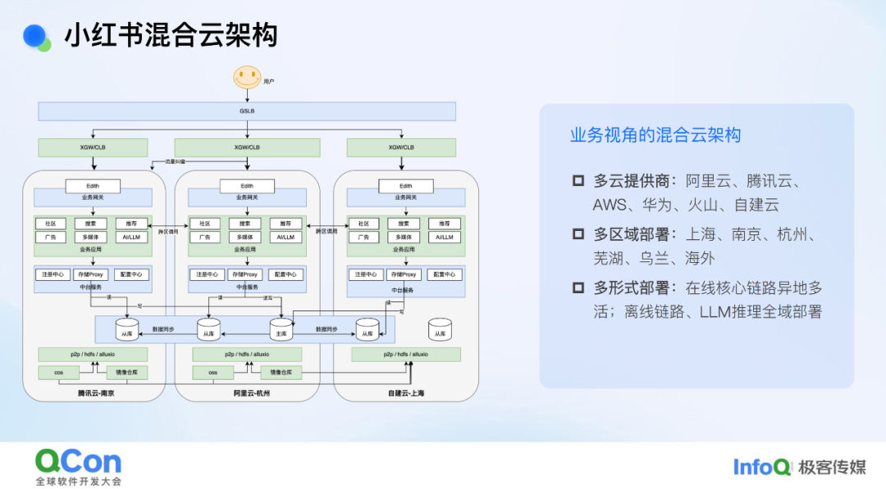
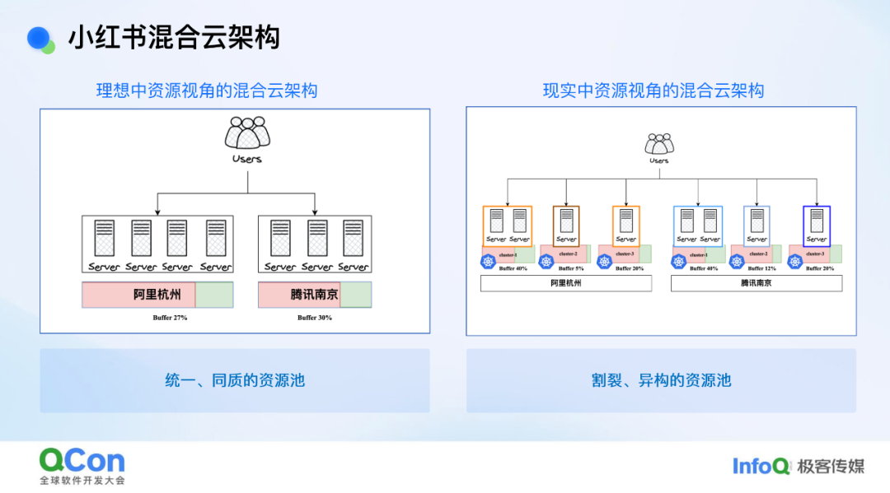
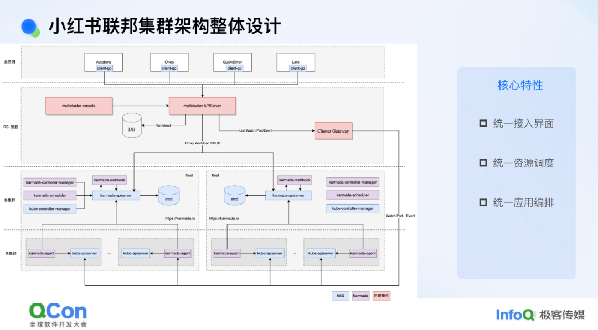
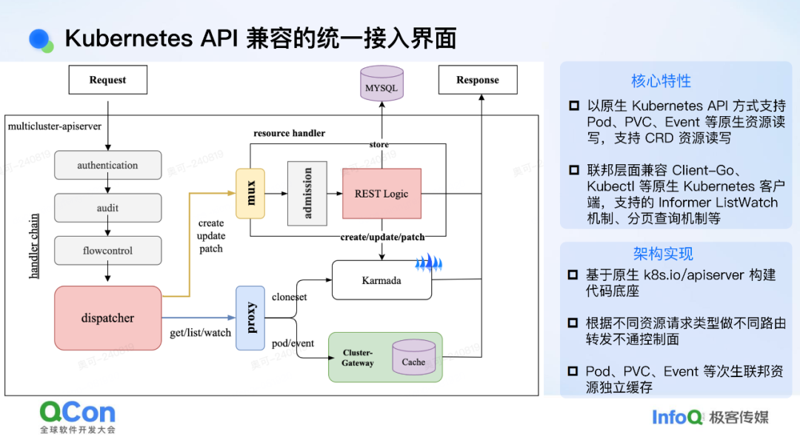
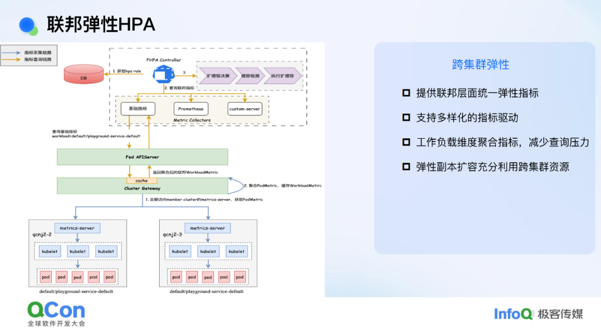
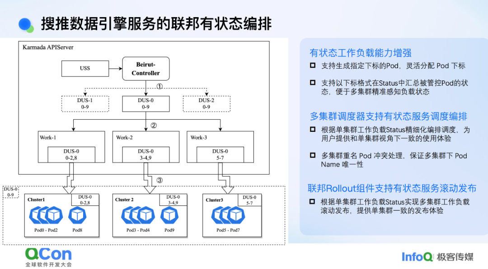
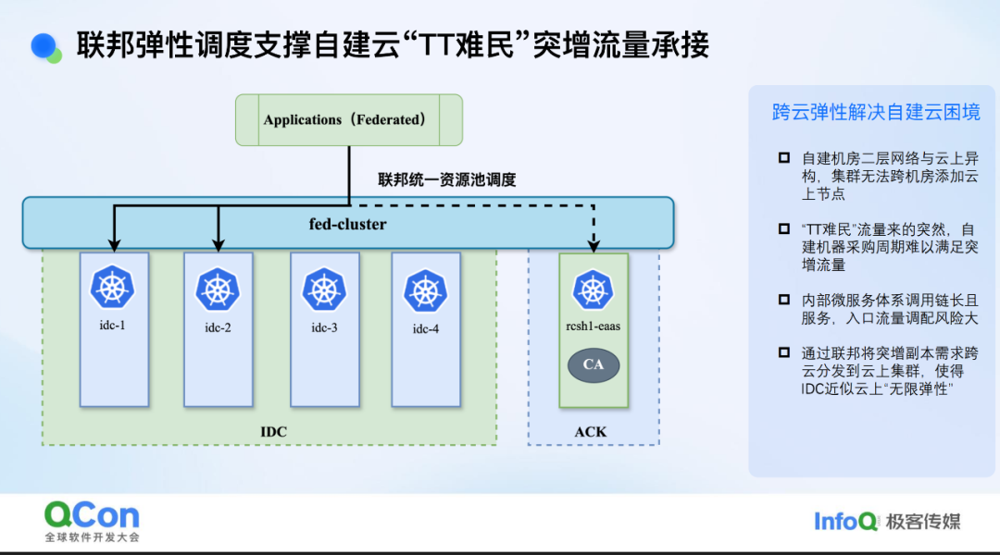
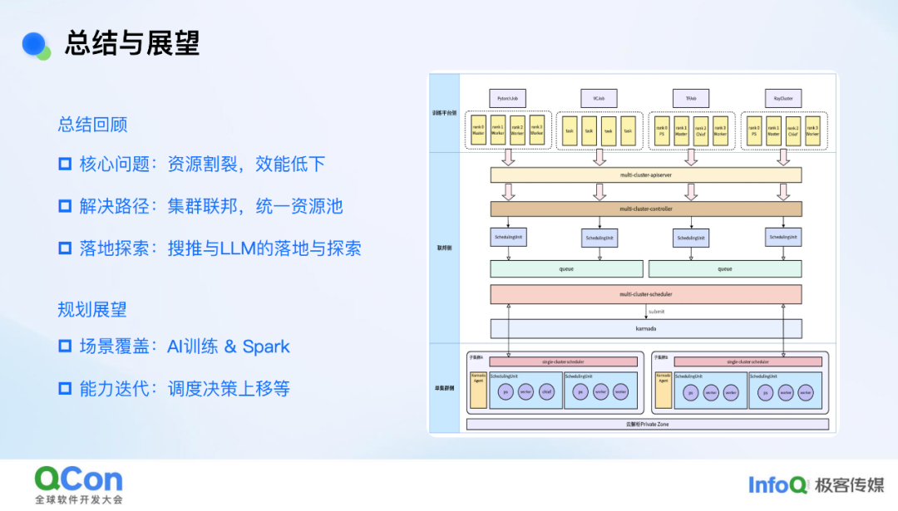

# 小红书混合云迎战 TikTok 难民：一套调度系统撬动云上云下

## 背景介绍

在跨集群、跨云的弹性调度上，小红书构建了以“自建优先”为原则的联邦调度体系，实现云上节点与云下自建集群的协同调度。当自建资源不足时，云上资源可以灵活兜底，承接突发或不可预期的资源需求。

今年 1 月，大量“TikTok 难民”涌入小红书，流量激增，自建机房一时间资源吃紧。面对这一突发情况，团队曾权衡两种方案：一是紧急高价采购服务器，但交付周期难以保证；二是调整各区域流量策略，临时更多依赖云上资源，但可能引发服务链扩容和成本激增的问题。最终，小红书选择依托这套联邦调度体系，将需要扩容的业务从自建机房平滑分流到云上。流量高峰过去后，再动态释放云上资源，实现业务的有序缩容。这套机制不仅守住了服务稳定性，也保障了自建资源的核心地位和成本可控性。

混合云环境下资源异构化和资源碎片化一直是制约资源效能的核心问题，而联邦化的弹性调度是解决这类问题的有效手段。近一年多以来，小红书内部逐渐将在线搜索推荐这类重数据、高敏感型业务，以及最近兴起的依赖 GPU 等异构算力的大语言模型（LLM）业务纳入到统一的联邦集群弹性调度架构体系，整合多云与多集群的碎片化资源形成全局资源池，实现了跨集群及跨云的弹性调度，在资源效能方面取得了不错的结果，也很好地应对了“Tiktok 难民潮” 等突发流量洪峰场景。本次分享将介绍小红书内部混合云架构下的联邦集群弹性调度的一些实践和探索。

以下是演讲实录：
本次演讲主要从底层基础设施团队的视角出发，聚焦于资源视角展开讨论。同时，结合业务落地情况，分享一些具体的案例。演讲内容大致分为三个部分：首先，简单介绍小红书目前混合云的现状以及面临的挑战；其次，针对这些挑战，阐述给出的技术解决方案及其设计和实现细节；最后，分享该解决方案在搜索推荐和大模型落地方面的实践与探索。

## 混合云架构与挑战

小红书一直被称作一家“长在云上”的公司，从第一行代码开始就运行在云端。直到近两年，随着资源总量达到较大规模，才开始开展自建云工作。目前，小红书与国内几家主流云服务提供商在很多场景下都有不同程度的合作，再结合自建云场景，整体混合云架构还是较为复杂的。

从业务架构角度看，小红书内部的在线服务采用了经典的异地多活部署模式，每个地域内基本形成了调用链闭环。而对于离线链路以及大模型推理服务，由于其调用延迟相对在线服务不那么敏感，目前仍处于全域部署状态，即哪里有资源就在哪里部署。

从底层资源视角来看现状，我们会发现理想与现实之间存在一些差距。以在线服务的部署为例，理想模式是这样的：在线服务选择一个区域进行部署，作为资源提供方或基础设施平台，我们只需告知该地域是否有资源以及能否满足其需求即可。我们希望业务方在该地域所感知到的是一个同质的、统一的资源池。然而在现实中，由于稳定性等因素以及现状原因，一个地域内的资源被拆分成了多个集群，甚至数十个集群。从业务视角来看，这就像是一个个割裂的小资源池。再加上机型异构的情况，资源调度就变得较为困难，这对效能提升来说是一个非常不利的因素。

从整个小红书混合云架构的背景来看，我们目前面临的挑战可以简单归结为以下几点。首先，由于成本以及稳定性考虑，我们采购了像 TKE/ACK（云厂商容器服务 Kubernetes 版）这样的容器服务，其单个集群规模存在较为严格的限制，这使得我们无法像阿里、蚂蚁那样采用大集群模式，而是对单个集群规模进行了严格限制。这种做法虽然在单集群视角下能够保障集群稳定性，但从整体资源视角来看，却造成了资源割裂的问题。

其次，小红书业务增长迅猛，对资源的需求也迅速增加。例如，一个集群可能在短短几个月内就被塞满。此时，业务方要么选择在其他集群重新部署一套服务，要么对服务进行集群间的迁移。这些操作不仅耗费业务团队的精力，也给 SRE（Site Reliability Engineering，网站可靠性工程）团队带来了较大人力负担，经常向基础设施团队提出挑战。

第三，集群割裂导致资源碎片化，进而引发了效能低下的问题。

最后，小红书自建云战略的引入带来了一些问题。目前，小红书自建机房的底层网络与云上网络是异构的，不在同一二层平面内。而在自建的 K8S 集群内部，我们出于性能考虑采用了 Underlay 网络方案，这使得我们很难将云上的节点直接加入到云下的集群中。然而，自建机器的采购周期较长，难以与业务增长需求严格匹配。当自建资源不足时，我们还是希望能够让云上的资源承接突发的或预期外的资源需求。

针对这些问题，我们有一个核心解决思路：向上对业务屏蔽集群概念，让业务方只需感知地域概念，统一其部署视角，从而减轻运维负担；向下从资源调度层面进行整合，这将有助于提升效能。

## 混合云联邦集群架构设计

### 小红书联邦集群架构整体设计

围绕这些问题，我们目前给出的解决方案是做集群的联邦，也可以称为联邦集群。我们做联邦集群的目的主要是从资源效能的视角出发。实际上，我们也与业界同等体量的公司（如携程）交流过，他们做联邦的目的更多是从单集群容灾或应用编排管理的角度切入，设计方案也围绕这些角度展开。而我们从资源视角切入，与他们的方案会有一些不同。我们聚焦的点主要有两个：一是向上对业务屏蔽集群概念，这就需要在联邦层抽象出完整应用编排或容器编排的能力；二是向下屏蔽各集群资源差异，这就需要在联邦层面着重建设调度能力。

基于这些要点，我们提出的方案核心包括三部分：第一部分是统一接入界面，目前我们选择沿用 K8S API 作为统一接入界面，这样可以保证容器团队对外窗口的一致性和一贯性，使得上层平台接入联邦时无需做额外适配；第二部分是统一资源调度，我们希望在联邦层面架设调度体系，实现跨集群的资源分发与调度；第三部分是统一应用编排能力，我们采用了开源的 Kamada 方案，但在其基础上做了一些适配和改进，例如对外屏蔽了 Kamada 自身引入的一些概念（如 PropagationPolicy 等），对外呈现的是类似于原生 K8S 集群的完整能力。

### Kubernetes APl 兼容的统一接入界面

我们是如何做到以 K8S（Kubernetes）API 作为一个统一的接入界面对外提供服务的呢？在介绍这一点之前，可能需要先跟大家介绍一下社区中联邦集群方案的一些背景。目前社区中的联邦方案，如 Kamada、OCM，它们都有一个共同点，即编排和调度都是在 Workload 这一层进行的，不会去感知 Pod、PVC 等次生资源。这样做的原因在于，像 Pod、PVC 这样的资源在整个联邦层面，其数据量是比较大的，如果直接将这些数据量引入到联邦层面的存储（如 ETCD）中，那与做大单集群相比就没有本质区别了，这仍然会对联邦管控带来性能和稳定性方面的挑战。

基于这一点，像 Kamada 这样的控制面，其实是无法直接对 Pod 或者 PVC 等资源进行 CRUD 操作的。为了解决这个问题，我们在其之上增加了一个统一的接入层。这个接入层的实现是以原生 K8S API 的代码作为底层基础构建的。这里有一个不同之处，就是我们会根据不同的资源请求进行一层路由。例如，如果请求的是 Kamada 相关的资源（如 Workload），我们就将其路由到 Kamada 的控制面；如果请求的是像 PVC 或者 Pod 这类 Kamada 无法关心的资源，我们就将其路由到下面的 ClusterGateway 这个自研组件上。这个组件的能力之一是会去 ListWatch 下面所有相关的资源，并且会模拟 ETCD 的行为，支持像 ListWatch、分页查询等 Informer 依赖的基础机制。这样做的好处是整个接入层能够完整地支持像 client-go 以及 kubectl 这样的原生 K8S 客户端。从业务或平台的角度来看，他们接入我们的联邦集群其实只需要拿到一个 kubeconfig 直接接入即可。对他们来说，几乎没有额外的改造成本。

### 统一资源调度

我们在统一资源调度方面目前是采用了一个多层调度方案。以管理我们自建云的联邦集群为例，这个集群不仅纳管了自建机房的资源，还纳管了一些云上机房的资源。这样做的原因是，当业务进行部署时，如果自建机房的资源不足，我们希望能够自动将资源弹性扩展到云上机房。反之，在缩容时，我们会优先缩容云上机房的资源，达到弹性用云的目的。

在单个机房内部，资源也会被拆分成多个 K8S 集群。针对这一点，我们实现了一个预调度能力。我们会获取底层集群的资源快照，并用它走一遍完整的调度逻辑。这样，我们就能知道对于当前应用，每个集群能够调度多少副本。有了这些信息，我们就可以在联邦层面更好地做出分发或调度决策，将工作负载或应用拆分到不同的集群中去。

### 统一联邦应用编排

统一联邦应用编排是在 Kamada 之上构建的一个统一应用联邦编排能力。原生 Kamada 社区中原生的编排模式相对简单，整体来说 Karmada 对于 Workload 的编排程包含拆分、同步、聚合三个步骤：按照调度结果进行拆分；将拆分后的 Spec 同步到下层集群；将下层集群的 Status 反向汇聚到联邦。这种简单的逻辑会带来一些编排问题，导致在生产环境中无法使用。例如，如果在联邦层面发布一个 Deployment，其最大不可用副本数设置为 1，期望的行为是一个副本一个副本地滚动更新。但在 Kamada 原生体系下，可能会将 Deployment 拆分到 10 个集群中，每个集群简单地同步，其最大不可用副本数也都是 1。这样一来，10 个集群累加起来最大不可用副本数量就变成了 10，一旦业务发布可能直接导致服务不可用，这是在生产环境不可接受的。

为了解决这个问题，我们在其之上实现了一个名为 Fleet-Root 的机制。这个机制的核心是在联邦层面精细化编排整个 Rollout 过程，使其满足联邦层面的各种 Rollout 相关的语义要求。这样，在联邦层面下发一个 Deployment 时，无论其 MaxUnavailable（最大不可用副本数）、MaxSurge（最大额外副本数）还是 Partition（分区发布）等参数是多少，联邦层面的编排行为都与下发到单个集群的行为完全一致。通过这种方式，消除了使用联邦集群与单集群之间的体验差异。

### 联邦弹性 HPA

我们在 HPA 组件上也做了一些改造，将整个 HPA 的能力往上移，提到了联邦层面。之所以这么做，是因为我们希望 HPA 触发的扩缩容能够走联邦的整体调度逻辑。这样一来，它就可以在联邦视角下有一个比较完整的编排视角，并且能够充分利用集群间的跨集群资源。除此之外，我们针对 CPU、内存这些基础指标也做了一些简单的聚合操作，从而减少对管控面的压力。

## 从搜推到 LLM 的业务实践与探索

在小红书内部，联邦技术的应用已经覆盖了从搜索推荐到大模型推理等多个重要场景。小红书的业务特点可以概括为：以搜索、广告和推荐（搜广推）为核心，兼具社交和电商功能。搜广推在小红书内部的资源占比非常高，其业务特点也非常明显。首先，这些业务的数据量极大。例如，单个服务处理的索引表规模可能达到 TB 级别。这就要求对索引表进行拆分和分片处理。在发布时，业务方不希望每次都要从头拉取整个索引表，而是只需追加增量部分。这表明业务对有状态编排的需求非常强烈。其次，这些服务对计算资源的需求也很大，尤其是随着大模型的兴起，搜广推结合大模型已经成为新的业务架构范式。大模型对 GPU 资源的依赖越来越重，这也对资源调度和管理提出了更高的要求。

### 搜推数据引擎服务的联邦有状态编排

我们先来看一下数据引擎服务。目前，这些服务采用有状态编排模式。然而，如果直接使用原生的 StatefulSet，它无法在联邦层面进行拆分。这是因为 StatefulSet 的下标编排不够灵活，容易导致 Pod 层面的命名和索引冲突问题。

基于这一点，我们自研了一个有状态编排的工作负载。其核心能力主要有两点：一是能够自定义编排索引，即可以自定义设置下标；二是可以在 Status 中精细化地汇报每个下标对应的 Pod 的状态。

有了这个工作负载后，我们在联邦层面的整体编排就变得简单了。联邦层面的主要编排工作变成只需要进行副本拆分后，再进行一层索引编排，就可以将一个有状态服务拆分到多个集群。例如，假设每个集群拆分到 3 个副本，共有 3 个集群，每个集群 3 个副本，总共 9 个副本。第一个集群可以是索引 0 到 2，第二个集群是索引 3 到 5，依此类推。完成索引编排后，再同步到下层集群。由于我们在状态中也进行了精细化的状态汇报，联邦层面可以根据每个索引对应的 Pod 状态做出相应的编排动作。这样，整个编排逻辑就会更加谨慎且简单。

### 联邦弹性调度支撑自建云“TT 难民”突增流量承接

借助联邦体系，我们在年初 TikTok 流量突增时，帮助自建机房顺利承接了这波流量。当时流量远超预期，自建资源已告罄，我们面临几条路：一是紧急采购机器，但临近春节，采购可能来不及且成本会大幅增加；二是利用小红书异地多活架构，在入口处调整各区域流量比例，如增加云上流量比例、减少自建流量比例。但这会带来问题，如需对整条服务链扩容，若中间有服务未扩容，可能引发意外问题，而且这也将个别服务的扩容诉求变成至整条服务链的扩容诉求，成本上也非常不划算。

利用联邦体系，我们轻松解决了问题。我们将云上集群（如 ACK 集群）加入联邦，当 IDC 缺乏资源时，业务扩容自动分发至 ACK 集群。流量高峰过后，我们直接退还 ACK 机器，业务在单个服务粒度定向缩容即可。这种方式针对服务粒度进行扩缩容，从成本和风险角度来说都是最低的。

### 联邦集群支撑 GPU 推理统一全局资源池弹性调度

除了搜索推荐场景外，大模型推理场景对联邦的需求也很大。目前，高性能 GPU 卡非常难获取，我们只能在有 GPU 卡的地域或集群中部署。这导致 GPU 资源的割裂比 CPU 更为严重。例如，小红书拥有几万张 GPU 卡，但它们分散在几十个集群中。这给业务部署带来了挑战，一个业务模型可能需要部署到多个集群中，这对业务方来说非常不便。此外，大模型推理场景与稀疏推理场景不同，很难通过 GPU 共享等手段提升 GPU 利用率。唯一的解决方案是利用弹性手段提高整个资源池的利用率，而 HPA 在提升 GPU 利用率方面具有重要作用，是为作基建团队为数不多的有效手段之一。

HPA 接入后也面临一些问题。例如，一个模型可能部署在 10 个集群中，如果没有联邦架构，每个集群都需要开启 HPA。HPA 的一个特点是必须至少保留一个副本。对于许多模型来说，在低峰期可能只需要一个推理实例。但由于 HPA 的限制，10 个集群中每个集群至少保留一个副本，这就意味着至少保留 10 个副本。如果涉及 100 个模型，就可能有几百张 GPU 卡空转，这对提升效能来说是难以接受的。因此，我们希望将这些模型迁移到联邦架构上。这样，业务方只需部署一次模型即可，后续只需对部署组或工作负载进行扩缩容操作，联邦会自动将资源分发到有资源的集群中。

在联邦层面开启 HPA 后，可以根据实际需求进行弹性扩缩容。例如，模型在低峰期只需一个副本即可，而不是之前的 10 个副本。这样，整体 GPU 资源利用率可以得到显著提升。

## 总结和展望

在小红书的混合云架构背景下，我们面临的核心问题是资源割裂和效能低下。为了解决这一问题，我们提出的方案是进行集群联邦和构建统一资源池。同时，我们也分享了在搜推和大模型推理场景中的落地实践与探索。

对于后续规划，我们主要有两个方向：一是覆盖更多场景，例如 AI 训练和 Spark 大数据场景等；二是进行能力迭代。目前，Karmada 社区也正在推动将 Volcano 调度器从单集群扩展到联邦集群，这与我们判断也比较一致。这一举措将调度决策上移，从而提升调度的准确性和时效性。

